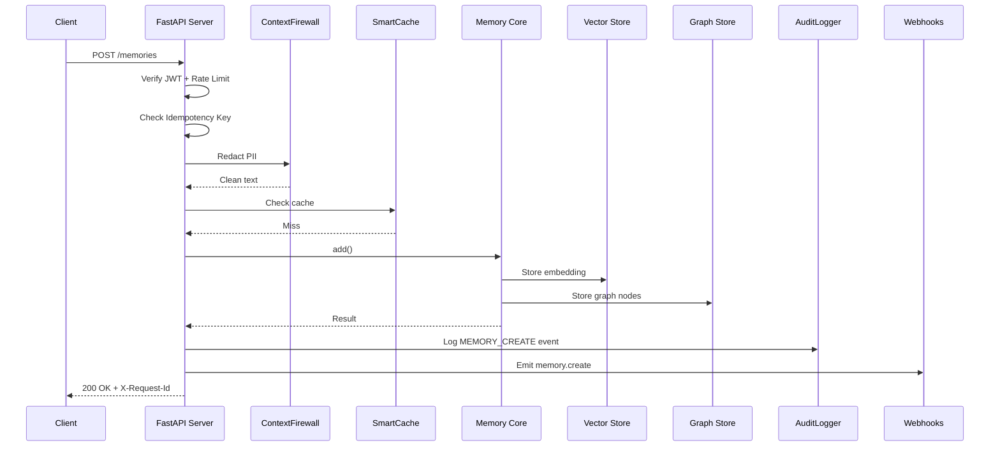
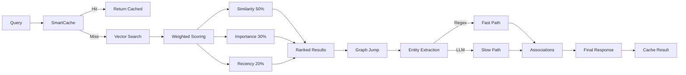

# Architecture Diagrams

## High-Level Architecture

```
┌──────────────────────────────────────────────────────────────────┐
│                        Client Layer                               │
│  Python SDK │ JS/TS SDK │ CLI │ LangChain │ LlamaIndex │ CrewAI  │
└────────────────────────┬─────────────────────────────────────────┘
                         │ HTTP / REST
┌────────────────────────▼─────────────────────────────────────────┐
│                      API Gateway (FastAPI)                        │
│  JWT Auth │ Rate Limit │ Idempotency │ Pagination │ SSE Streaming│
│  Request ID Tracing │ Audit Logging │ Circuit Breakers           │
├──────────────────────────────────────────────────────────────────┤
│                     Memory Core (12 Layers)                       │
│                                                                   │
│  L1  Perception  ──► L2  Reflexive  ──► L3  Working (Cache)      │
│  L4  Episodic    ──► L5  Lifecycle    ──► L6  Dreaming           │
│  L7  Enterprise  ──► L8  Compression  ──► L9  Procedural         │
│  L10 Graph       ──► L11 Recollection ──► L12 Ego/Reflection    │
│                                                                   │
├──────────────────────────────────────────────────────────────────┤
│                   Security & Performance                          │
│  ContextFirewall │ AuditLogger │ SmartCache │ BatchEmbedder      │
│  LazyEngines     │ QueryCache  │ RetryUtils │ ErrorBoundaries    │
│  EventSourcing   │ CQRS        │ Webhooks   │ Templates          │
│  RedisPubSub     │ Metrics     │            │                    │
├──────────────────────────────────────────────────────────────────┤
│                     Storage Layer                                 │
│  PostgreSQL + pgvector │ Redis (L1 Cache) │ Supabase Realtime    │
└──────────────────────────────────────────────────────────────────┘
```

## Data Flow: Memory Creation



## Recollection Flow



## Component Dependencies

```
mem0/
├── core/
│   └── interfaces.py          # ABCs for all providers
├── memory/
│   ├── sync_memory.py         # Main Memory class (sync)
│   ├── async_memory.py        # Main Memory class (async)
│   ├── base.py                # MemoryBase ABC
│   ├── bridge.py              # Multi-agent memory bridge
│   ├── dreaming.py            # Layer 6: Dreaming Engine
│   ├── ego.py                 # Layer 12: Ego Engine
│   ├── hybrid_search.py       # Semantic + Keyword RRF
│   ├── lifelong.py            # Lifelong learning
│   ├── metadata_filter.py     # Metadata filter builder
│   ├── orchestrator.py        # Context paging
│   ├── procedural_memory.py   # Layer 9: Procedural memory
│   ├── recollection.py        # Layer 11: Recollection
│   ├── reflection.py          # Layer 12: Reflection
│   ├── reflective.py          # Meta-cognitive reflection
│   ├── staleness.py           # Staleness detection
│   ├── storage.py             # SQLite history
│   ├── storage_postgres.py    # PostgreSQL history
│   ├── surprise.py            # Novelty detection
│   ├── temporal_search.py     # Time-travel queries
│   ├── tool_state.py          # Tool state persistence
│   └── utils.py               # Shared utilities
├── security/
│   ├── context_firewall.py    # PII redaction
│   └── audit_log.py           # Structured audit logging
├── configs/                   # Configuration classes
├── vector_stores/             # Vector store providers
├── graph_stores/              # Graph store providers
├── llms/                      # LLM providers
├── embeddings/                # Embedding providers
├── reranker/                  # Reranking providers
├── batch_embedder.py          # Batch embedding wrapper
├── lazy_engines.py            # Lazy engine registry
├── query_cache.py             # Query plan cache
├── smart_cache.py             # Intelligent cache wrapper
├── error_boundaries.py        # Circuit breakers
├── retry_utils.py             # Retry with backoff
├── event_sourcing.py          # Immutable event log
├── cqrs.py                    # Command/Query buses
├── webhooks.py                # Event-driven webhooks
├── templates.py               # Memory templates
├── redis_pubsub.py            # Real-time sync
├── metrics.py                 # Prometheus metrics
├── client.py                  # Python SDK client
├── cli.py                     # CLI tool
├── langchain_integration.py   # LangChain memory
├── llamaindex_integration.py  # LlamaIndex vector store
├── crewai_integration.py      # CrewAI memory
├── mcp_server.py              # MCP server
└── bot_skeleton.py            # Slack/Discord bot
```
