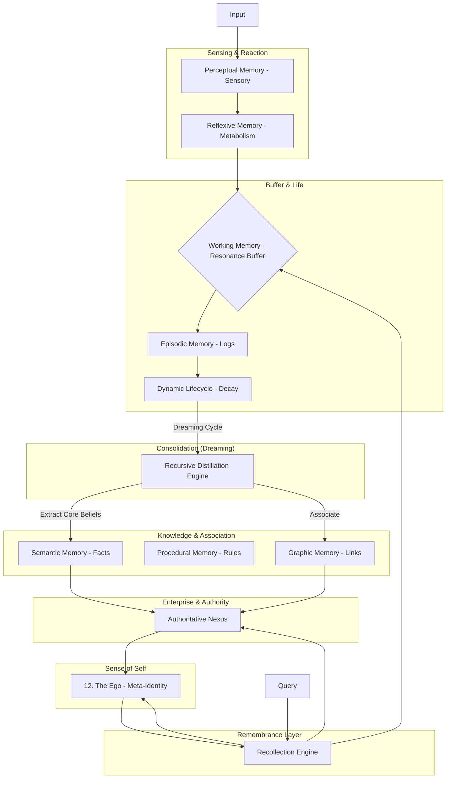

# 🧠 Cognitive Memory Architecture

Mem0 Supabase Edition emulates the human cognitive system through a **12-layer** hierarchical architecture. This structure ensures that AI agents can sense, react, learn, manage knowledge, and **evolve their own identity**.

---

## 👁️ 1. Perceptual Memory (Sensory)
*   **Purpose**: Processing raw physical stimuli (images, audio).
*   **Implementation**: [mem0/multimodal.py](file:///c:/Users/msrov/Downloads/mem0-main/mem0-main/mem0/multimodal.py)

## ⚡ 2. Reflexive Memory (Selective Metabolism)
*   **Purpose**: Immediate processing gatekeeper. Uses the **Surprise Filter** to decide if a fact is novel (flashbulb) or redundant (reinforcement).
*   **Implementation**: [mem0/memory/surprise.py](file:///c:/Users/msrov/Downloads/mem0-main/mem0-main/mem0/memory/surprise.py) & [mem0/memory/base_supabase.py](file:///c:/Users/msrov/Downloads/mem0-main/mem0-main/mem0/memory/base_supabase.py) using Supabase Realtime.

## 🧠 3. Working Memory (Short-Term Resonance)
*   **Purpose**: Zero-latency retrieval of local context and recent cross-agent resonance pulses.
*   **Implementation**: `self.resonance_buffer` in [mem0/memory/main.py](file:///c:/Users/msrov/Downloads/mem0-main/mem0-main/mem0/memory/main.py)

## 📔 4. Episodic Memory (Living History)
*   **Purpose**: Continuous sequential record.
*   **Implementation**: [mem0/memory/storage_postgres.py](file:///c:/Users/msrov/Downloads/mem0-main/mem0-main/mem0/memory/storage_postgres.py)

## ♻️ 5. Dynamic Lifecycle (Decay & Archive)
*   **Purpose**: Managing memory durability and "Forgetting Curve".
*   **Implementation**: [mem0/lifecycle.py](file:///c:/Users/msrov/Downloads/mem0-main/mem0-main/mem0/lifecycle.py)

## 🌙 6. Consolidation Memory (Recursive Dreaming)
*   **Purpose**: Knowledge distillation and semantic clustering.
*   **Implementation**: SQL RPCs `find_memory_clusters` and `consolidate_memories`.

## 🏢 7. Authoritative Nexus (Enterprise Sharing)
*   **Purpose**: Controlled, permissioned knowledge sharing.
*   **Implementation**: [mem0/enterprise.py](file:///c:/Users/msrov/Downloads/mem0-main/mem0-main/mem0/enterprise.py)

## 🎯 8. Semantic Memory (Core Facts)
*   **Purpose**: Consolidated world wisdom.
*   **Implementation**: [mem0/memory/main.py](file:///c:/Users/msrov/Downloads/mem0-main/mem0-main/mem0/memory/main.py)

## 📜 9. Procedural Memory (Skills)
*   **Purpose**: Instructions and protocols.
*   **Logic**: `memory_type = 'procedural'` tags.

## 🕸️ 10. Graphic Memory (Associative)
*   **Purpose**: Relational reasoning.
*   **Implementation**: [mem0/graph_stores/supabase.py](file:///c:/Users/msrov/Downloads/mem0-main/mem0-main/mem0/graph_stores/supabase.py)

## ⚓ 11. Recollection Engine (Remembrance)
*   **Purpose**: Unified weighted recall (Similarity + Recency + Importance).
*   **Implementation**: [mem0/recollection.py](file:///c:/Users/msrov/Downloads/mem0-main/mem0-main/mem0/recollection.py)

## 🎭 12. The Ego (Meta-Identity Synthesis)
*   **Purpose**: Self-reflective persona maintenance and behavioral consistency.
*   **Implementation**: [mem0/memory/ego.py](file:///c:/Users/msrov/Downloads/mem0-main/mem0-main/mem0/memory/ego.py)
*   **Logic**: Distills identity from the lower layers to guide agent interactions.

---

## 🕰️ Dimensional Layer: Temporal Memory
Wraps all layers with `valid_from` and `valid_to` for **Time-Travel Queries**.
- **Implementation**: [mem0/temporal.py](file:///c:/Users/msrov/Downloads/mem0-main/mem0-main/mem0/temporal.py)
