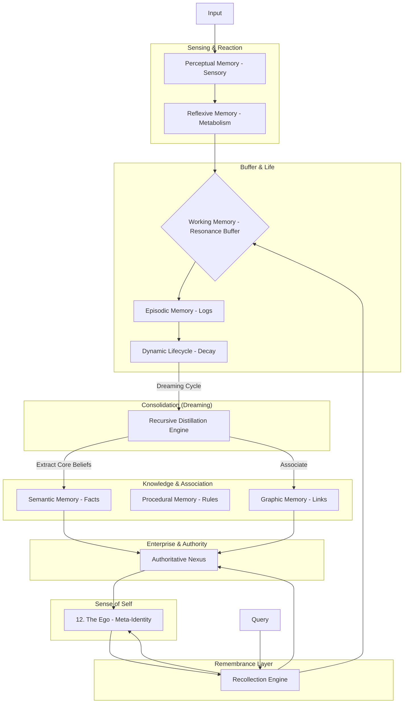

# 🧠 Cognitive Memory Architecture

Mem0 Supabase Edition emulates the human cognitive system through a **12-layer** hierarchical architecture. This structure ensures that AI agents can sense, react, learn, manage knowledge, and **evolve their own identity**.

```mermaid
graph TD
    subgraph "Sensing & Reaction"
        SNS[Perceptual Memory - Sensory]
        RFX[Reflexive Memory - Metabolism]
    end

    subgraph "Buffer & Life"
        WKM{Working Memory - Resonance Buffer}
        EPI[Episodic Memory - Logs]
        LIF[Dynamic Lifecycle - Decay]
    end
    
    subgraph "Consolidation (Dreaming)"
        DRM[Recursive Distillation Engine]
    end
    
    subgraph "Knowledge & Association"
        SEM[Semantic Memory - Facts]
        PRO[Procedural Memory - Rules]
        GRA[Graphic Memory - Links]
    end

    subgraph "Enterprise & Authority"
        NEX[Authoritative Nexus]
    end

    subgraph "Sense of Self"
        EGO[12. The Ego - Meta-Identity]
    end

    subgraph "Remembrance Layer"
        REC[Recollection Engine]
    end

    Input --> SNS
    SNS --> RFX
    RFX --> WKM
    WKM --> EPI
    EPI --> LIF
    LIF -->|Dreaming Cycle| DRM
    DRM -->|Extract Core Beliefs| SEM
    DRM -->|Associate| GRA
    SEM --> NEX
    GRA --> NEX
    
    NEX --> EGO
    EGO --> REC
    
    Query --> REC
    REC --> NEX
    REC --> WKM
    REC --> EGO
```

> [!NOTE]
> **Unified Access**: The `Memory.process_interaction()` method acts as the central orchestrator (Smart Pipe), activating these layers to Recall (context) and Learn (storage) in a single flow.

---

## 👁️ 1. Perceptual Memory (Sensory)
*   **Purpose**: Processing raw physical stimuli (images, audio).
*   **Implementation**: [multimodal.py](file:///c:/Users/bm2311640/Documents/trae_projects/mem0-supabase/mem0-supabase-main/mem0/multimodal.py)

## ⚡ 2. Reflexive Memory (Selective Metabolism & Compression)
*   **Purpose**: Immediate processing gatekeeper. Uses the **Surprise Filter** to decide if a fact is novel (flashbulb) or redundant (reinforcement).
*   **Salto 1: Semantic Compression**: Automatically merges redundant facts into single, dense memories using LLM-based deduplication.
*   **Implementation**: [mem0/memory/surprise.py](file:///c:/Users/bm2311640/Documents/trae_projects/mem0-supabase/mem0-supabase-main/mem0/memory/surprise.py) & [mem0/memory/sync_memory.py](file:///c:/Users/bm2311640/Documents/trae_projects/mem0-supabase/mem0-supabase-main/mem0/memory/sync_memory.py)

## 🧠 3. Working Memory (Short-Term Resonance & Paging)
*   **Purpose**: Zero-latency retrieval of local context and recent cross-agent resonance pulses.
*   **Salto 2: Context Paging**: Automatically orchestrates the context window, summarizing "paged-out" results into a background context to maintain infinite recall without token overflow.
*   **Implementation**: `self.resonance_buffer` and [mem0/memory/orchestrator.py](file:///c:/Users/bm2311640/Documents/trae_projects/mem0-supabase/mem0-supabase-main/mem0/memory/orchestrator.py)

## 📔 4. Episodic Memory (Living History)
*   **Purpose**: Continuous sequential record.
*   **Implementation**: [storage_postgres.py](file:///c:/Users/bm2311640/Documents/trae_projects/mem0-supabase/mem0-supabase-main/mem0/memory/storage_postgres.py)

## ♻️ 5. Dynamic Lifecycle (Decay & Archive)
*   **Purpose**: Managing memory durability and "Forgetting Curve".
*   **Implementation**: [lifecycle.py](file:///c:/Users/bm2311640/Documents/trae_projects/mem0-supabase/mem0-supabase-main/mem0/lifecycle.py)

## 🌙 6. Consolidation Memory (Recursive Dreaming)
*   **Purpose**: Knowledge distillation and semantic clustering.
*   **Dreaming Engine**: Background motor that generates **Synthetic Memories** by cross-referencing disparate facts.
*   **Implementation**: [mem0/memory/dreaming.py](file:///c:/Users/bm2311640/Documents/trae_projects/mem0-supabase/mem0-supabase-main/mem0/memory/dreaming.py) and SQL RPCs `find_memory_clusters`.

## 🏢 7. Authoritative Nexus (Enterprise Sharing & Bridge)
*   **Purpose**: Controlled, permissioned knowledge sharing.
*   **Memory Bridge**: Granular Private/Shared memory synchronization between different specialized agents.
*   **Implementation**: [mem0/enterprise.py](file:///c:/Users/bm2311640/Documents/trae_projects/mem0-supabase/mem0-supabase-main/mem0/enterprise.py) and [mem0/memory/bridge.py](file:///c:/Users/bm2311640/Documents/trae_projects/mem0-supabase/mem0-supabase-main/mem0/memory/bridge.py)

## 🎯 8. Semantic Memory (Core Facts)
*   **Purpose**: Consolidated world wisdom.
*   **Implementation**: [memory/base.py](file:///c:/Users/bm2311640/Documents/trae_projects/mem0-supabase/mem0-supabase-main/mem0/memory/base.py)

## 📜 9. Procedural Memory (Skills & Tool-State)
*   **Purpose**: Instructions and protocols.
*   **Tool-State Memory**: Natively saves and restores the exact state of AI tools (browser tabs, file cursors, CLI variables) for pure stateful agency.
*   **Implementation**: [mem0/memory/tool_state.py](file:///c:/Users/bm2311640/Documents/trae_projects/mem0-supabase/mem0-supabase-main/mem0/memory/tool_state.py)

## 🕸️ 10. Graphic Memory (Associative)
*   **Purpose**: Relational reasoning.
*   **Implementation**: [graph_stores/supabase.py](file:///c:/Users/bm2311640/Documents/trae_projects/mem0-supabase/mem0-supabase-main/mem0/graph_stores/supabase.py)

## ⚓ 11. Recollection Engine (Remembrance & Heartbeats)
*   **Purpose**: Unified weighted recall (Similarity + Recency + Importance).
*   **Proactive Heartbeats**: Generates autonomous agent suggestions based on detected memory triggers during recall.
*   **Implementation**: [mem0/recollection.py](file:///c:/Users/bm2311640/Documents/trae_projects/mem0-supabase/mem0-supabase-main/mem0/recollection.py)

## 🎭 12. The Ego (Meta-Identity & Reflection)
*   **Purpose**: Self-reflective persona maintenance and behavioral consistency.
*   **Salto 3: Agentic Compaction**: Automatically rewrites dense chat history into high-level principles to evolve the agent's meta-identity.
*   **Implementation**: [mem0/memory/reflection.py](file:///c:/Users/bm2311640/Documents/trae_projects/mem0-supabase/mem0-supabase-main/mem0/memory/reflection.py) and [mem0/memory/ego.py](file:///c:/Users/bm2311640/Documents/trae_projects/mem0-supabase/mem0-supabase-main/mem0/memory/ego.py)

---

## 🕰️ Dimensional Layer: Temporal Memory
Wraps all layers with `valid_from` and `valid_to` for **Time-Travel Queries**.
- **Implementation**: [temporal.py](file:///c:/Users/bm2311640/Documents/trae_projects/mem0-supabase/mem0-supabase-main/mem0/temporal.py)
